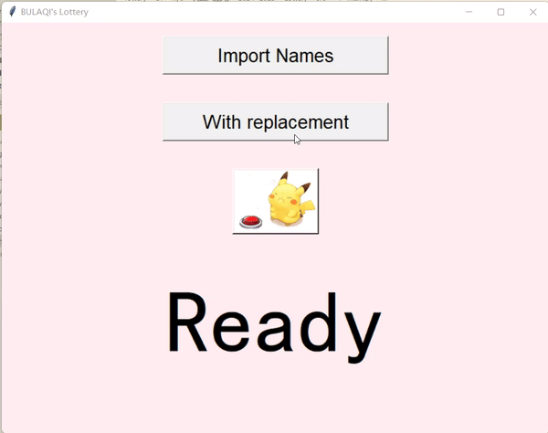

# Lottery

A simple lottery

## 项目简介

该程序通过 Tkinter 实现了一个简单的抽奖功能。用户可以导入参与者名单并选择抽奖模式，目前有**放回抽样**和**不放回抽样**两种模式。运行界面如下所示。

<p align="center">
  
</p>

## 目录结构

``` txt
Lottery/
├── src/
│   ├── main.py
│   ├── ui.py
│   ├── const.py
│   └── lottery_logic.py
├── assets/
│   ├── button.png
│   └── demo.gif
└── README.md
```

## 使用方法

- 将参与者名单保存在一个`.txt`文件中，每行以`编号.姓名`的格式编写。例如

``` txt
1.小明
2.小红
3.小白
```

- 点击`Import Names`按钮，选择文件以导入名单
- 选择对应的放回抽样(**With replacement**)或不放回抽样(**Without replacement**)模式。
- 点击皮卡丘按钮图像开始抽奖

## 许可协议

本项目采用 [MIT 许可协议](https://opensource.org/licenses/MIT) 进行授权。
